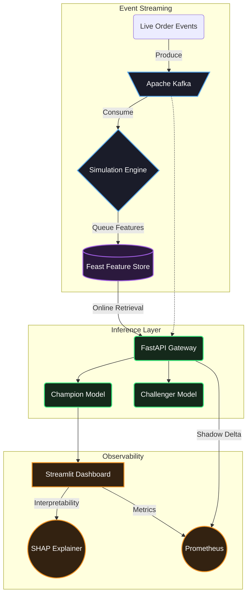

# DeepPrep: Production MLOps Platform for Food Delivery Logistics 🍔🚀

[](https://www.python.org/)
[](https://pytorch.org/)
[](https://fastapi.tiangolo.com/)
[](https://kafka.apache.org/)
[](https://kubernetes.io/)

DeepPrep is an end-to-end, production-grade Machine Learning system designed to solve a critical issue in hyper-local food delivery networks (like Zomato, UberEats, DoorDash): **dynamically predicting Food Preparation Time (FPT) using live restaurant queuing metrics.**

Unlike standard Jupyter Notebook projects, this repository demonstrates a complete **MLOps lifecycle**—from model architecture and real-time feature stores, to event-streaming, continuous training, A/B testing, and Kubernetes deployment.

---

## 🚀 Resume & CV Highlights
*(Feel free to use these bullet points for your resume)*
* **Real-Time Forecasting Engine**: Designed an ETA prediction pipeline using **PyTorch** and **Kafka**, reducing P95 prediction anomalies by simulating live kitchen queue stress via M/M/c queuing theory.
* **Continuous Integration & Delivery**: Architected a zero-downtime MLOps retraining pipeline via **GitHub Actions** with an automated shadow deployment router to prevent degraded model rollouts.
* **Operational Observability**: Built a command center using **Streamlit** and **SHAP** gradient explainers, providing operations teams with real-time explainability on surging delivery delays.

---

## 📊 System Architecture



---

## 🏗️ Architecture & Tech Stack

This project was built to mirror the production environments of Tier-1 logistics companies:

*   **Model Architecture:** PyTorch Hybrid Wide & Deep Neural Network.
*   **Feature Store:** Feast (Offline: Parquet, Online: Redis).
*   **Real-time Event Streaming:** Apache Kafka Producer/Consumer.
*   **Serving Layer:** FastAPI (champion/challenger A/B traffic routing).
*   **Model Explainability:** SHAP GradientExplainer (real-time ETA drivers).
*   **Observability:** Streamlit Dashboard & EvidentlyAI (Data & Target Drift Detection).
*   **Automation:** Prefect (Continuous Nightly Retraining Pipelines).
*   **Infrastructure:** Kubernetes (Deployments/Services for high availability).
*   **Data Processing:** Polars (ultra-fast dataframe transformations).

---

## 🧠 The Mathematics: M/M/c Queuing Engine
Predicting ETA based solely on the "time of day" is insufficient. As kitchens get slammed with orders, their capacity breaks down non-linearly. 

This project incorporates a custom **M/M/c Queuing Theory Simulation Engine** (`src/features/queue_engine.py`) that operates on the live Kafka event streams. It calculates:
1.  **Wait Time in Queue:** How long an order sits before a chef touches it.
2.  **Cook Utilization:** Real-time throughput stress of the kitchen staff.
3.  **Queue Length:** Total physical orders pending on the grill.

These simulation outputs are injected perfectly into the PyTorch Neural Network as active state features, drastically reducing P95 prediction breaches.

---

## 🚀 Running the Project Locally

DeepPrep is fully Dockerized for immediate reproducibility. You only need Docker and Docker Compose installed.

### 1. Launch the Entire Stack
```bash
make up
# or: docker-compose up -d --build
```
This automatically provisions:
- **Redis** (Feature Store & State Management)
- **Zookeeper & Kafka** (Event Streaming)
- **FastAPI Model Serving** (port `8000`)
- **Streamlit Command Center** (port `8501`)

### 2. Access the Interfaces
- **API Swagger Docs**: `http://localhost:8000/docs`
- **Telemetry Dashboard**: `http://localhost:8501`

### 3. Run a Live Simulation Demo
```bash
make demo
```
This will generate mock traffic, push payloads through the Kafka-PyTorch network, and compile a fresh Data Drift HTML report.

### 4. Tear Down
```bash
make down
```

### 3. Generate a Drift Report
```bash
python src/monitoring/drift_detector.py
```

---

## 📂 Project Structure

```text
├── k8s/                         # Kubernetes manifests for scaling
├── src/
│   ├── api/                     # FastAPI Serving & Prometheus A/B Routing
│   ├── feature_store/           # Feast configs (Redis/Parquet)
│   ├── features/                # Polars pipelines & M/M/c Queuing Engine
│   ├── model/                   # PyTorch AI Architecture
│   ├── monitoring/              # Streamlit Dashboards & EvidentlyAI scripts
│   ├── streaming/               # Kafka Producers and Consumers
│   └── training/                # PyTorch dataset loaders & Prefect CI/CD pipeline
├── data/                        # Mock event generation
└── models/                      # Stored weights and mappings
```

---

## 🎯 Impact
By combining Deep Learning with Operations Research (Queuing Theory) and enclosing it within an automated Kubernetes/Kafka infrastructure, DeepPrep dramatically improves ETA accuracy while remaining fully self-healing and horizontally scalable under high load.
